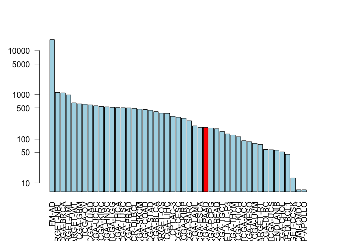

Class 18: Investigating cancer genomics datasets
================

Exploring the Cancer Genome Atlas
---------------------------------

Install the packages we need

``` r
library(GenomicDataCommons)
```

    ## Loading required package: magrittr

    ## 
    ## Attaching package: 'GenomicDataCommons'

    ## The following object is masked from 'package:stats':
    ## 
    ##     filter

``` r
library(TCGAbiolinks)
library(maftools)
```

Can we talk with the NCI

``` r
GenomicDataCommons::status()
```

    ## $commit
    ## [1] "3e22a4257d5079ae9f7193950b51ed9dfc561ed1"
    ## 
    ## $data_release
    ## [1] "Data Release 17.0 - June 05, 2019"
    ## 
    ## $status
    ## [1] "OK"
    ## 
    ## $tag
    ## [1] "1.21.0"
    ## 
    ## $version
    ## [1] 1

Querying the GDC from R
-----------------------

``` r
cases_by_project <- cases() %>%
  facet("project.project_id") %>%
  aggregations()
head(cases_by_project)
```

    ## $project.project_id
    ##                      key doc_count
    ## 1                  FM-AD     18004
    ## 2             TARGET-NBL      1120
    ## 3              TCGA-BRCA      1098
    ## 4             TARGET-AML       988
    ## 5              TARGET-WT       652
    ## 6               TCGA-GBM       617
    ## 7                TCGA-OV       608
    ## 8              TCGA-LUAD       585
    ## 9              TCGA-UCEC       560
    ## 10             TCGA-KIRC       537
    ## 11             TCGA-HNSC       528
    ## 12              TCGA-LGG       516
    ## 13             TCGA-THCA       507
    ## 14             TCGA-LUSC       504
    ## 15             TCGA-PRAD       500
    ## 16          NCICCR-DLBCL       489
    ## 17             TCGA-SKCM       470
    ## 18             TCGA-COAD       461
    ## 19             TCGA-STAD       443
    ## 20             TCGA-BLCA       412
    ## 21             TARGET-OS       381
    ## 22             TCGA-LIHC       377
    ## 23               CPTAC-3       322
    ## 24             TCGA-CESC       307
    ## 25             TCGA-KIRP       291
    ## 26             TCGA-SARC       261
    ## 27             TCGA-LAML       200
    ## 28             TCGA-ESCA       185
    ## 29             TCGA-PAAD       185
    ## 30             TCGA-PCPG       179
    ## 31             TCGA-READ       172
    ## 32             TCGA-TGCT       150
    ## 33         TARGET-ALL-P3       131
    ## 34             TCGA-THYM       124
    ## 35             TCGA-KICH       113
    ## 36              TCGA-ACC        92
    ## 37             TCGA-MESO        87
    ## 38              TCGA-UVM        80
    ## 39             TARGET-RT        75
    ## 40             TCGA-DLBC        58
    ## 41              TCGA-UCS        57
    ## 42 BEATAML1.0-CRENOLANIB        56
    ## 43             TCGA-CHOL        51
    ## 44           CTSP-DLBCL1        45
    ## 45           TARGET-CCSK        13
    ## 46             HCMI-CMDC         7
    ## 47        VAREPOP-APOLLO         7

``` r
x <- cases_by_project$project.project_id

# Make a custom color vector for our plot
colvec <- rep("lightblue", nrow(x))
colvec[29] <- "red"

# Plot with 'log' for y axis and rotate labels with 'las'
#par(___)  
barplot(x$doc_count, names.arg=x$key, log="y", col=colvec, las=2)
```



Part 2: Designing a personalized cancer vaccine
-----------------------------------------------

Read in FASTA protein file sequence for both healthy and tumor tissue

``` r
bio3d::read.fasta("lecture18_sequences.fa")
```

    ##              1        .         .         .         .         .         60 
    ## P53_wt       MEEPQSDPSVEPPLSQETFSDLWKLLPENNVLSPLPSQAMDDLMLSPDDIEQWFTEDPGP
    ## P53_mutant   MEEPQSDPSVEPPLSQETFSDLWKLLPENNVLSPLPSQAMLDLMLSPDDIEQWFTEDPGP
    ##              **************************************** ******************* 
    ##              1        .         .         .         .         .         60 
    ## 
    ##             61        .         .         .         .         .         120 
    ## P53_wt       DEAPRMPEAAPPVAPAPAAPTPAAPAPAPSWPLSSSVPSQKTYQGSYGFRLGFLHSGTAK
    ## P53_mutant   DEAPWMPEAAPPVAPAPAAPTPAAPAPAPSWPLSSSVPSQKTYQGSYGFRLGFLHSGTAK
    ##              **** ******************************************************* 
    ##             61        .         .         .         .         .         120 
    ## 
    ##            121        .         .         .         .         .         180 
    ## P53_wt       SVTCTYSPALNKMFCQLAKTCPVQLWVDSTPPPGTRVRAMAIYKQSQHMTEVVRRCPHHE
    ## P53_mutant   SVTCTYSPALNKMFCQLAKTCPVQLWVDSTPPPGTRVRAMAIYKQSQHMTEVVRRCPHHE
    ##              ************************************************************ 
    ##            121        .         .         .         .         .         180 
    ## 
    ##            181        .         .         .         .         .         240 
    ## P53_wt       RCSDSDGLAPPQHLIRVEGNLRVEYLDDRNTFRHSVVVPYEPPEVGSDCTTIHYNYMCNS
    ## P53_mutant   RCSDSDGLAPPQHLIRVEGNLRVEYLDDRNTFVHSVVVPYEPPEVGSDCTTIHYNYMCNS
    ##              ******************************** *************************** 
    ##            181        .         .         .         .         .         240 
    ## 
    ##            241        .         .         .         .         .         300 
    ## P53_wt       SCMGGMNRRPILTIITLEDSSGNLLGRNSFEVRVCACPGRDRRTEEENLRKKGEPHHELP
    ## P53_mutant   SCMGGMNRRPILTIITLEV-----------------------------------------
    ##              ******************                                           
    ##            241        .         .         .         .         .         300 
    ## 
    ##            301        .         .         .         .         .         360 
    ## P53_wt       PGSTKRALPNNTSSSPQPKKKPLDGEYFTLQIRGRERFEMFRELNEALELKDAQAGKEPG
    ## P53_mutant   ------------------------------------------------------------
    ##                                                                           
    ##            301        .         .         .         .         .         360 
    ## 
    ##            361        .         .         .  393 
    ## P53_wt       GSRAHSSHLKSKKGQSTSRHKKLMFKTEGPDSD
    ## P53_mutant   ---------------------------------
    ##                                                
    ##            361        .         .         .  393 
    ## 
    ## Call:
    ##   bio3d::read.fasta(file = "lecture18_sequences.fa")
    ## 
    ## Class:
    ##   fasta
    ## 
    ## Alignment dimensions:
    ##   2 sequence rows; 393 position columns (259 non-gap, 134 gap) 
    ## 
    ## + attr: id, ali, call

``` r
library(bio3d)
seqs <- read.fasta("lecture18_sequences.fa")
seqs
```

    ##              1        .         .         .         .         .         60 
    ## P53_wt       MEEPQSDPSVEPPLSQETFSDLWKLLPENNVLSPLPSQAMDDLMLSPDDIEQWFTEDPGP
    ## P53_mutant   MEEPQSDPSVEPPLSQETFSDLWKLLPENNVLSPLPSQAMLDLMLSPDDIEQWFTEDPGP
    ##              **************************************** ******************* 
    ##              1        .         .         .         .         .         60 
    ## 
    ##             61        .         .         .         .         .         120 
    ## P53_wt       DEAPRMPEAAPPVAPAPAAPTPAAPAPAPSWPLSSSVPSQKTYQGSYGFRLGFLHSGTAK
    ## P53_mutant   DEAPWMPEAAPPVAPAPAAPTPAAPAPAPSWPLSSSVPSQKTYQGSYGFRLGFLHSGTAK
    ##              **** ******************************************************* 
    ##             61        .         .         .         .         .         120 
    ## 
    ##            121        .         .         .         .         .         180 
    ## P53_wt       SVTCTYSPALNKMFCQLAKTCPVQLWVDSTPPPGTRVRAMAIYKQSQHMTEVVRRCPHHE
    ## P53_mutant   SVTCTYSPALNKMFCQLAKTCPVQLWVDSTPPPGTRVRAMAIYKQSQHMTEVVRRCPHHE
    ##              ************************************************************ 
    ##            121        .         .         .         .         .         180 
    ## 
    ##            181        .         .         .         .         .         240 
    ## P53_wt       RCSDSDGLAPPQHLIRVEGNLRVEYLDDRNTFRHSVVVPYEPPEVGSDCTTIHYNYMCNS
    ## P53_mutant   RCSDSDGLAPPQHLIRVEGNLRVEYLDDRNTFVHSVVVPYEPPEVGSDCTTIHYNYMCNS
    ##              ******************************** *************************** 
    ##            181        .         .         .         .         .         240 
    ## 
    ##            241        .         .         .         .         .         300 
    ## P53_wt       SCMGGMNRRPILTIITLEDSSGNLLGRNSFEVRVCACPGRDRRTEEENLRKKGEPHHELP
    ## P53_mutant   SCMGGMNRRPILTIITLEV-----------------------------------------
    ##              ******************                                           
    ##            241        .         .         .         .         .         300 
    ## 
    ##            301        .         .         .         .         .         360 
    ## P53_wt       PGSTKRALPNNTSSSPQPKKKPLDGEYFTLQIRGRERFEMFRELNEALELKDAQAGKEPG
    ## P53_mutant   ------------------------------------------------------------
    ##                                                                           
    ##            301        .         .         .         .         .         360 
    ## 
    ##            361        .         .         .  393 
    ## P53_wt       GSRAHSSHLKSKKGQSTSRHKKLMFKTEGPDSD
    ## P53_mutant   ---------------------------------
    ##                                                
    ##            361        .         .         .  393 
    ## 
    ## Call:
    ##   read.fasta(file = "lecture18_sequences.fa")
    ## 
    ## Class:
    ##   fasta
    ## 
    ## Alignment dimensions:
    ##   2 sequence rows; 393 position columns (259 non-gap, 134 gap) 
    ## 
    ## + attr: id, ali, call

Identify tumor specific 9-mer peptides
--------------------------------------

Now to find where the sequences differ

``` r
ide<- conserv(seqs, method= "identity")
ide
```

    ##   [1] 1.0 1.0 1.0 1.0 1.0 1.0 1.0 1.0 1.0 1.0 1.0 1.0 1.0 1.0 1.0 1.0 1.0
    ##  [18] 1.0 1.0 1.0 1.0 1.0 1.0 1.0 1.0 1.0 1.0 1.0 1.0 1.0 1.0 1.0 1.0 1.0
    ##  [35] 1.0 1.0 1.0 1.0 1.0 1.0 0.5 1.0 1.0 1.0 1.0 1.0 1.0 1.0 1.0 1.0 1.0
    ##  [52] 1.0 1.0 1.0 1.0 1.0 1.0 1.0 1.0 1.0 1.0 1.0 1.0 1.0 0.5 1.0 1.0 1.0
    ##  [69] 1.0 1.0 1.0 1.0 1.0 1.0 1.0 1.0 1.0 1.0 1.0 1.0 1.0 1.0 1.0 1.0 1.0
    ##  [86] 1.0 1.0 1.0 1.0 1.0 1.0 1.0 1.0 1.0 1.0 1.0 1.0 1.0 1.0 1.0 1.0 1.0
    ## [103] 1.0 1.0 1.0 1.0 1.0 1.0 1.0 1.0 1.0 1.0 1.0 1.0 1.0 1.0 1.0 1.0 1.0
    ## [120] 1.0 1.0 1.0 1.0 1.0 1.0 1.0 1.0 1.0 1.0 1.0 1.0 1.0 1.0 1.0 1.0 1.0
    ## [137] 1.0 1.0 1.0 1.0 1.0 1.0 1.0 1.0 1.0 1.0 1.0 1.0 1.0 1.0 1.0 1.0 1.0
    ## [154] 1.0 1.0 1.0 1.0 1.0 1.0 1.0 1.0 1.0 1.0 1.0 1.0 1.0 1.0 1.0 1.0 1.0
    ## [171] 1.0 1.0 1.0 1.0 1.0 1.0 1.0 1.0 1.0 1.0 1.0 1.0 1.0 1.0 1.0 1.0 1.0
    ## [188] 1.0 1.0 1.0 1.0 1.0 1.0 1.0 1.0 1.0 1.0 1.0 1.0 1.0 1.0 1.0 1.0 1.0
    ## [205] 1.0 1.0 1.0 1.0 1.0 1.0 1.0 1.0 0.5 1.0 1.0 1.0 1.0 1.0 1.0 1.0 1.0
    ## [222] 1.0 1.0 1.0 1.0 1.0 1.0 1.0 1.0 1.0 1.0 1.0 1.0 1.0 1.0 1.0 1.0 1.0
    ## [239] 1.0 1.0 1.0 1.0 1.0 1.0 1.0 1.0 1.0 1.0 1.0 1.0 1.0 1.0 1.0 1.0 1.0
    ## [256] 1.0 1.0 1.0 0.5 0.5 0.5 0.5 0.5 0.5 0.5 0.5 0.5 0.5 0.5 0.5 0.5 0.5
    ## [273] 0.5 0.5 0.5 0.5 0.5 0.5 0.5 0.5 0.5 0.5 0.5 0.5 0.5 0.5 0.5 0.5 0.5
    ## [290] 0.5 0.5 0.5 0.5 0.5 0.5 0.5 0.5 0.5 0.5 0.5 0.5 0.5 0.5 0.5 0.5 0.5
    ## [307] 0.5 0.5 0.5 0.5 0.5 0.5 0.5 0.5 0.5 0.5 0.5 0.5 0.5 0.5 0.5 0.5 0.5
    ## [324] 0.5 0.5 0.5 0.5 0.5 0.5 0.5 0.5 0.5 0.5 0.5 0.5 0.5 0.5 0.5 0.5 0.5
    ## [341] 0.5 0.5 0.5 0.5 0.5 0.5 0.5 0.5 0.5 0.5 0.5 0.5 0.5 0.5 0.5 0.5 0.5
    ## [358] 0.5 0.5 0.5 0.5 0.5 0.5 0.5 0.5 0.5 0.5 0.5 0.5 0.5 0.5 0.5 0.5 0.5
    ## [375] 0.5 0.5 0.5 0.5 0.5 0.5 0.5 0.5 0.5 0.5 0.5 0.5 0.5 0.5 0.5 0.5 0.5
    ## [392] 0.5 0.5

``` r
mis.match.sites <- which(ide< 1)
gap.sites <- gap.inspect(seqs)$t.inds
```

``` r
gap.sites
```

    ##   [1] 260 261 262 263 264 265 266 267 268 269 270 271 272 273 274 275 276
    ##  [18] 277 278 279 280 281 282 283 284 285 286 287 288 289 290 291 292 293
    ##  [35] 294 295 296 297 298 299 300 301 302 303 304 305 306 307 308 309 310
    ##  [52] 311 312 313 314 315 316 317 318 319 320 321 322 323 324 325 326 327
    ##  [69] 328 329 330 331 332 333 334 335 336 337 338 339 340 341 342 343 344
    ##  [86] 345 346 347 348 349 350 351 352 353 354 355 356 357 358 359 360 361
    ## [103] 362 363 364 365 366 367 368 369 370 371 372 373 374 375 376 377 378
    ## [120] 379 380 381 382 383 384 385 386 387 388 389 390 391 392 393

``` r
tumor.sites<- mis.match.sites[!mis.match.sites%in%gap.sites]
tumor.sites
```

    ## [1]  41  65 213 259

Now get the sequence with all possible 9-mers

``` r
start.position <- tumor.sites- 8
end.position <- tumor.sites +8
```

``` r
start.position[1]: end.position[1]
```

    ##  [1] 33 34 35 36 37 38 39 40 41 42 43 44 45 46 47 48 49

Get the tumor sequence

``` r
seqs$ali[2, start.position[1]: end.position[1] ]
```

    ##  [1] "S" "P" "L" "P" "S" "Q" "A" "M" "L" "D" "L" "M" "L" "S" "P" "D" "D"
